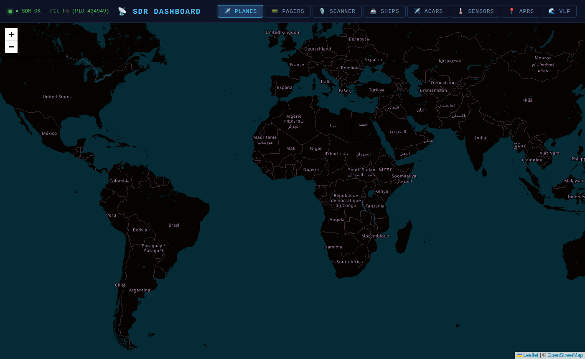

# plug-and-sdr

  

**Zero-setup web dashboard for RTL-SDR — planes, pagers, ACARS, APRS, VLF spectrum and more**



A self-hosted, single-page dashboard that turns a cheap RTL-SDR dongle into a multi-mode radio monitoring station. Everything runs locally — no cloud, no API keys, no external dependencies beyond a few `apt` packages.

---

## Features

- ✈️ **Planes** — Live ADS-B aircraft map (dump1090) with tail/callsign/altitude/speed
- 📟 **Pagers** — FLEX & POCSAG decoder with CAP code directory and org tagging
- 🎙️ **Scanner** — AM/FM audio player with presets for ATC, ham, weather, public safety
- 🚢 **Ships** — AIS vessel tracking map (rtl_ais + built-in NMEA parser)
- ✈️ **ACARS** — Airline text messages decoded live from 131 MHz
- 🌡️ **Sensors** — rtl_433 ISM-band sensor decoder (weather stations, tire sensors, etc.)
- 📍 **APRS** — Ham radio packet tracking via direwolf, live map + sidebar
- 🌊 **VLF** — Spectrum display 10–100 kHz with annotated military/time stations

---

## Requirements

- Linux (Ubuntu 22.04 / Debian 12 recommended)
- RTL-SDR dongle (RTL-SDR Blog V4 recommended; any RTL2832U-based dongle works)
- Python 3.8+

### System packages

```bash
sudo apt install rtl-sdr dump1090-mutability multimon-ng direwolf ffmpeg
pip install -r requirements.txt
```

For ACARS decoding, install [acarsdec](https://github.com/TLeconte/acarsdec).
For sensor decoding, install [rtl_433](https://github.com/merbanan/rtl_433) (see `docs/INSTALL.md`).
For AIS ship tracking, install [rtl_ais](https://github.com/dgiardini/rtl-ais) (see `docs/INSTALL.md`).

---

## Installation

```bash
git clone https://github.com/ehudettun/plug-and-sdr.git
cd plug-and-sdr
pip install -r requirements.txt
```

---

## Configuration

Edit `config.yaml` before first run:

```yaml
site_lat: 42.12       # Your latitude (centers the maps)
site_lon: -71.18      # Your longitude
site_name: "My SDR Station"

aircraft_json: "/usr/share/dump1090-mutability/html/data/aircraft.json"
pager_freq: "152.5984"   # Default pager frequency
rtl_gain: 49
dashboard_port: 8888

pager_orgs:
  - name: "My Local Hospital"
    pattern: "my hospital name|local phone prefix"
```

The `pager_orgs` list lets you tag pager CAP codes with organization names based on message text patterns. Remove the example entries and add patterns for orgs in your area.

---

## Running

```bash
python3 server.py
```

Then open **http://localhost:8888** in your browser.

Click a tab to switch modes. The SDR dongle switches automatically — only one mode uses the hardware at a time (except the scanner, which streams audio on demand).

---

## Running as a systemd service

See [`docs/INSTALL.md`](docs/INSTALL.md) for a complete systemd unit file and instructions.

---

## License

MIT — see [LICENSE](LICENSE).
